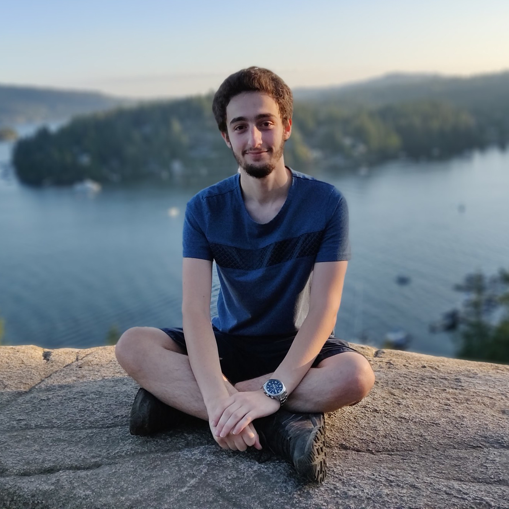

{:.center width="400px" align="center" srcset="/assets/img/blog/arthur-pesah.jpg"}

**Contact**: arthur.pesah.20@ucl.ac.uk
{:.message}

I am a PhD student at University College London (UCL), 
enrolled in the [CDT in Delivering Quantum Technologies](https://www.ucl.ac.uk/quantum/study-here/cdt-delivering-quantum-technologies). I currently work on quantum error correction in Dan Browne's group, with a focus on 3D topological codes. Recently I have been working on [tailoring 3D codes for biased noise](https://arxiv.org/abs/2211.02116), and on developing the open-source library [PanQEC](https://github.com/panqec/panqec) for simulating and [visualizing](https://gui.quantumcodes.io/) topological codes (with my collaborator Eric Huang).

I received a MSc with a double degree in mathematics and theoretical physics from ENSTA (Paris) and KTH (Stockholm).
I did my [master's thesis](http://www.diva-portal.org/smash/record.jsf?pid=diva2%3A1320072&dswid=-7150) on variational circuits for quantum data 
at the University of Toronto with Peter Wittek. In 2019, I worked for seven months at [1QBit](http://1qbit.com/), in Vancouver and Waterloo, 
applying reinforcement learning to quantum annealing problems. 
I spent my Summer 2020 at Los Alamos National Laboratory, where I contributed to a paper on the [absence of barren plateaus in quantum convolutional neural networks](https://arxiv.org/abs/2011.02966).

I have worked on a variety of topics in machine learning (domain adaptation, likelihood-free inference, 
federated learning), accelerator physics (impedance models in particle accelerators) 
and quantum computing (error correction, variational circuits, continuous-variable QC, quantum annealing).
You can find my CV [here](https://artix41.github.io/assets/pdf/cv-arthur-pesah.pdf).

If you have similar interests, feel free to reach out, I always enjoy discussing research and meeting new people!

**Photo credits**: profile picture by [Alison Pouplin](http://a-pouplin.github.io) and background picture by [Lukas Schlagenhauf](https://www.flickr.com/photos/lschlagenhauf/)
{:.message}