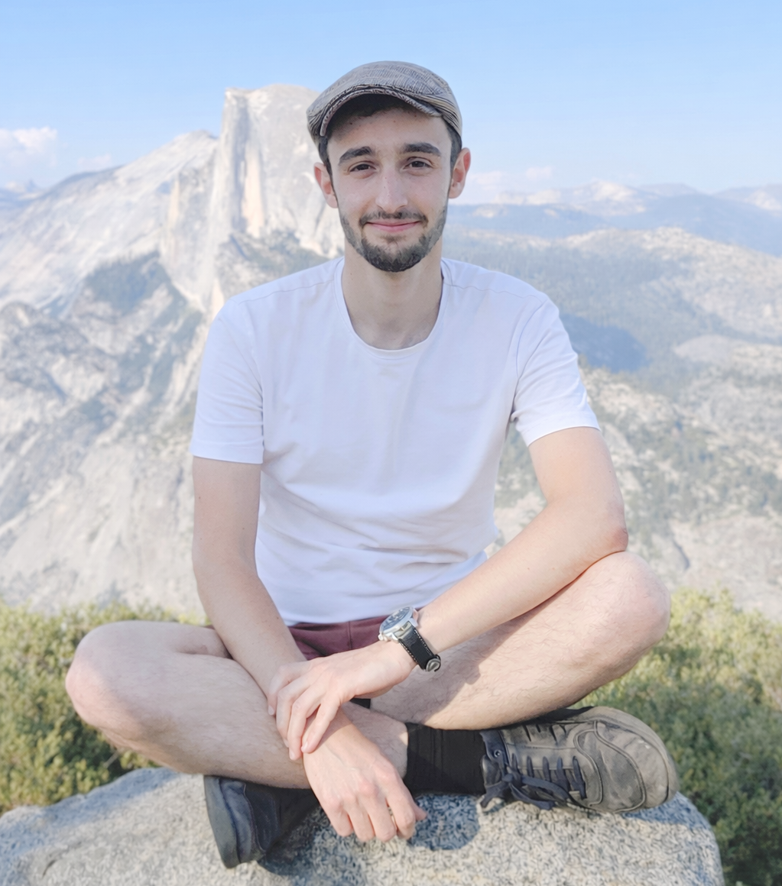

{:.center width="400px" align="center" srcset="/assets/img/blog/arthur-pesah.png"}

**Contact**: arthur.pesah@gmail.com
{:.message}

I am a postdoctoral researcher at Freie Universität (FU) Berlin, working in the [group of Jens Eisert](https://www.physik.fu-berlin.de/einrichtungen/ag/ag-eisert/index.html), and a research consultant for the photonic quantum computing company [Xanadu](https://xanadu.ai/).
My research focuses on quantum error correction, with particular interests in spacetime codes, three-dimensional codes, non-Clifford logical computation, and biased noise.

I completed my PhD at University College London (UCL) under the supervision of Dan Browne, as part of the [CDT in Delivering Quantum Technologies](https://www.ucl.ac.uk/quantum/study-here/cdt-delivering-quantum-technologies). In my thesis, *[Quantum error correction in three dimensions and beyond]()*, I explored generalization of three-dimensional codes and fault-tolerant protocols.
I am also a co-developer of the open-source library [PanQEC](https://github.com/panqec/panqec), a framework for simulating and [visualizing](https://gui.quantumcodes.io/) topological quantum codes, developed in collaboration with Eric Huang.

I hold a double MSc degree in mathematics and theoretical physics from ENSTA (Paris) and KTH (Stockholm). During my master’s, I worked at the University of Toronto with Peter Wittek on variational quantum circuits for quantum data.

You can find my full CV [here](https://artix41.github.io/assets/pdf/cv-arthur-pesah.pdf).

If you have similar interests, feel free to reach out, I always enjoy discussing research and meeting new people!

**Photo credits**: profile picture by [Dominik Kufel](https://dom-kufel.github.io/) (at Yosemite!), and background picture by [Lukas Schlagenhauf](https://www.flickr.com/photos/lschlagenhauf/)
{:.message}